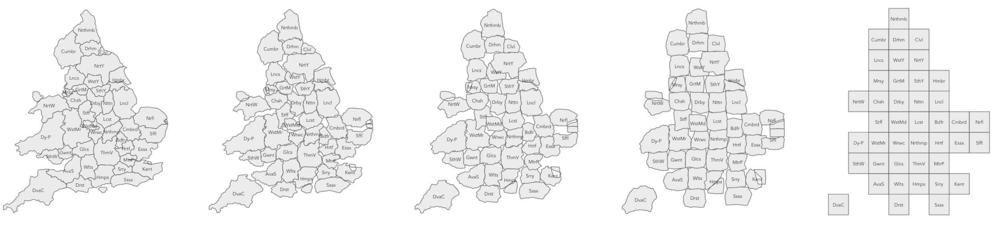
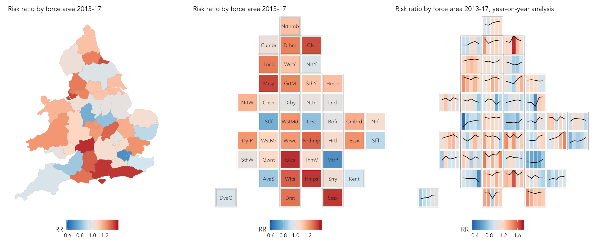

Reproducible road safety research: an exploration of the shifting
spatial and temporal distribution of car-pedestrian crashes
================
Dr Robin Lovelace — University of Leeds, Consumer Data Research Centre
(CDRC) and Institute for Transport Studies (ITS) and Leeds Institute for
Data Analytics (LIDA)
2019-01-31

# Summary

This paper demonstrates a reproducible approach to download, format and
analyse road crash data. Using the recently released **stats19** R
package, it is based on a dataset of half a million incidents (78,448
car-pedestrian crashes) from the UK STATS19 database, from 2013 to 2017.
The analysis reveals variability in crash characteristics depending on
social, environmental and regulatory factors, and variable police force
performance in terms of ‘risk ratios’ over time. Geographic ‘small
multiple’ visualisations show the potential of the approach to feed into
interactive dashboards and maps to inform road safety policy, suggesting
multiple directions for reproducible road safety
research.

<!-- Authors are requested to keep to the word limit of 1500 words. The word limit includes the main body of the abstract and everything within (including captions etc.,) and the references. Not included in the word count is the title, author list, date, summary, keywords and author biographies -->

**Keywords:** geographic analysis, road safety, reproducibility

# Introduction

This paper is motivated by two high-level policy and academic
objectives, which intersect. The policy objective is to provide high
quality evidence and the ‘best available data’ in an ‘actionable’ form.
The academic objective is to ensure that research findings can be
reproduced, to ensure scientific falsifiability and encourage
cooperation between researchers. These two objectives intersect because
without reproducible methods it is difficult to generate high quality
evidence that can be externally verified. Conversely, an academic
environment that is conducive to collaboration and not competition
requires a government that supports ‘open science’, “the transparent and
accessible knowledge \[and methods\] shared and developed through
collaborative networks” (Vicente-Saez and Martinez-Fuentes 2018).

This context is relevant to many fields of research that have practical
and policy implications. Road safety research is no exception, as its
findings often have direct policy implications and can be highly
emotive, raising questions about the divide between research and policy
(Elvik et al. 2009):

> Can science and politics be kept apart in such a highly applied field
> of research? Where is the dividing line between science and politics
> in road safety?

More specifically, how can road safety research become more
reproducible? This would clearly have advantages for many stakeholders:
local and national governments would be better equipped to justify their
road safety policies if the evidence on which they are based is the
result of reproducible research conducive to ‘citizen science’ (Bonney
et al. 2014); advocacy groups such as RoadPeace would be able to engage
not only in lobbying, but also science, encouraging arguments from all
sides to be based more on objective evidence, rather than emotive
anecdote; and citizens themselves should benefit, from better road
safety policies and the educational opportunities created by open
science.

A more mundane motivation was that dozens of researchers are duplicating
effort by cleaning road crash data, a process first undertaken by one of
the authors three years ago (Lovelace, Roberts, and Kellar 2016) (the
code used to clean the data can still be found on
[GitHub](https://github.com/Robinlovelace/bikeR)). The problem is that
the official source of road crash data, called STATS19 (Department for
Transport 2017), is provided in a series of opaque `.csv` files, which
provide only integer values. This has meant that, instead of pooling
data cleaning resources and focussing on the data analysis and research,
much time is spent doing data cleaning, duplicating previous work. To
solve this problem, the **stats19** package was developed, which
automatically downloads and formats STATS19 data. Written in the popular
statistical programming language R (R Core Team 2019), **stats19** was
published on the Comprehensive R Archive Network (CRAN) in January 2019
(Lovelace et al. 2019).

**stats19** can convert the non-geographic data into a geographic
representation of the crashes, an important feature given that much
recent road safety research has been conducted using Geographic
Information Systems (GIS) software (e.g. Kim and Levine 1996; Peled and
Hakkert 1993; Steenberghen et al. 2004; Razzak, Khan, and Jalal 2011).
With the growth of open source GIS products such as QGIS, this is a
trend that can encourage open science, as defined above. A limitation of
dedicated GIS software products from a reproducibility perspective,
however, is that they tend to be based on a graphic user interface
(GUI), rather than a command-line interface (CLI). This has led to many
efforts to push geographic research in more reproducible and
computational directions, under labels such as Geographic Information
Science (GIScience), Geographic Data Science, and Geocomputation
(Lovelace, Nowosad, and Meunchow
2019).

<!-- On a practical level, the work detailed in this paper is indicative of reproducible worklflows because it uses code to define the geographic analysis steps undertaken and a stanardised API for accessing and processing data (**stats19** R package) [@lovelace_stats19_2019], allowing findings to be externally verified. -->

This paper ‘practices what it preaches’ in terms of reproducibility:
code chunks in ‘RMarkdown’ (`.Rmd` files) run each time the document is
compiled (Xie, Allaire, and Grolemund 2018). Thus, beyond the high-level
aims of evidence-based policy and reproducible research, this paper has
a more specific purpose: to demonstrates that geographic road safety
research *can* (and probably usually *should*) now be reproducible.
<!-- with an example that presents new findings on the shifting spatial distribution of car-pedestrian crashes at the national level over the last 5 years. -->

# Set-up and data preparation

<!-- We include an example of how to access, process and briefly analyse data _within this paper_, to demonstrate the importance of such initiatives for enabling replication of methods, validation of findings and, subsequently, cumulative knowledge building. -->

As with many computational tasks, the first stage is to install and load
the necessary software. This is done in the code chunk below which, when
run from an R console (CLI), installs and loads the key packages used:

``` r
pkgs = c(
  "tidyverse",
  "sf",
  "stats19",
  "tmap"
)
```

``` r
install.packages(pkgs)
purrr::map_lgl(pkgs, require, character.only = TRUE)
```

    ## tidyverse        sf   stats19      tmap 
    ##      TRUE      TRUE      TRUE      TRUE

The following code downloads, formats and combines crash data over the
past 5 years:\[1\]

``` r
y = 2013:2017
a = map_dfr(y, get_stats19, type = "accidents")
```

The resulting dataset is large, consisting of more than half a million
<!-- () --> (691,641) rows (crash points), with 31 columns (see Lovelace
et al. 2019 for details on the data). This is easy to work with
in-memory on modern computers, though consumes 1/3 GB of RAM. These can
be converted into a spatial class, defined by the **sf** package
(Pebesma 2018). A sample of 1000 records is taken and plotted, for
demonstration purposes, as follows (see the resulting Figure 1):

``` r
a_sf = format_sf(a)
a_sample = a_sf %>% sample_n(1000)
plot(a_sample)
```


Having gained a measure of the crash data, and some key descriptive
statistics, we can proceed to join-on the associated casualty and
vehicle tables. The following command uses the argument `type` to
specify which table from the STATS19 schema is to be read-in:

``` r
c = map_dfr(y, get_stats19, type = "casualties")
v = map_dfr(y, get_stats19, type = "vehicle")
```

We are interested in accidents in which a pedestrian was injured and
where the (only) vehicle involved was a car. This subset of the
casualties dataset can be extracted as follows:

``` r
c_ped = c %>% filter(casualty_type == "Pedestrian")
v_car = v %>% filter(vehicle_type == "Car")
a_cp = a_sf %>%
  filter(number_of_vehicles == 1 & number_of_casualties == 1) %>% 
  filter(accident_index %in% c_ped$accident_index) %>% 
  filter(accident_index %in% v_car$accident_index)
```

Before proceeding, we join the vehicle and crash tables onto the crash
data as follows, to create the main input dataset used in this paper:
<!-- , keeping only records in which casualty *and* vehicle data is present. -->

``` r
a_cpj = a_cp %>% 
  inner_join(v_car) %>% 
  inner_join(c_ped)
```

The resulting dataset, `a_cpj`, contains 78,454 rows: 11% of the crashes
in the original dataset represent a car-pedestrian collision involving a
single vehicle and a single casualty (the pedestrian). This dataset,
which contains 68 columns, will be used for the remainder of this
analysis, and can be downloaded from the paper’s GitHub repo and loaded
as
follows:

``` r
u = "https://github.com/Robinlovelace/stats19-gisruk/releases/download/0.0.1/a_cpj.Rds"
download.file(url = u, destfile = "a_cpj.Rds")
a_cpj = readRDS("a_cpj.Rds")
```

The final code chunk in this section generates plots that expose insight
into the nature of car-pedestrian crashes. As illustrated in Figures 2
and 3, the results match prior expectations: elderly people (in the
66-75 and 75+ age bands) and fast roads (40 to 70 miles per hour) tend
to result in more serious and fatal injuries.

``` r
g = ggplot(a_cpj)
```

``` r
g + geom_bar(aes(accident_severity, fill = urban_or_rural_area)) +
 facet_wrap(vars(speed_limit), scales = "free_y") +
  labs(fill = "Location")

g + geom_bar(aes(accident_severity, fill = impact)) +
  facet_wrap(vars(age_band_of_casualty), scales = "free_y") +
  theme(axis.text.x = element_text(angle = 45))
```


# Geographic analysis and results

The data is still in a spatial form, of class `sf`, enabling geographic
analysis. Although the geographic resolution of the data is high, ~10 m,
we will analyse it at the national level, to investigate the relative
performance of different police forces over time. A geographic join will
be used to assign a police force to each crash (although police force is
already a variable in the dataset):

``` r
agg_slight = aggregate(a_cpj["accident_severity"], police_boundaries,
                      function(x) sum(grepl(pattern = "Slight", x)))
```


Repeating this process for each crash severity type results in the plot
presented in Figure 3. Because a log scale is used between the different
crash categories, the results shown in Figure 3 shows that, outside
London, serious and fatal crashes are comparatively common in some
areas. We can identify which police forces have the highest *ratios* of
crashes that are reported as fatal. The top 5 and bottom 5 are shown in
Table 1, which shows wide variability. As would be expected, large
cities (where average speeds tend to be low) tend to have a relatively
low percentage of car-pedestrian casualties that are fatal, whereas
predominantly rural forces such as Wiltshire and Gloucestershire (where
the roads tend to be faster, and there are fewer crashes overall) have a
relatively high proportion that are fatal. Devon and Cornwall is an
outlier: a relatively rural force with a low proportion of fatalities.
Further research could seek to explore the reasons for this variability.

| name                | slight | serious | fatal | percent\_fatal |
| :------------------ | -----: | ------: | ----: | -------------: |
| Wiltshire           |    428 |     155 |    15 |            2.5 |
| Gloucestershire     |    347 |     137 |    10 |            2.0 |
| West Mercia         |    772 |     216 |    20 |            2.0 |
| Northamptonshire    |    515 |     187 |    14 |            2.0 |
| Suffolk             |    546 |     116 |    13 |            1.9 |
| NA                  |     NA |      NA |    NA |             NA |
| Devon and Cornwall  |   1556 |     384 |    16 |            0.8 |
| Lancashire          |   1718 |     626 |    19 |            0.8 |
| Nottinghamshire     |   1102 |     290 |    10 |            0.7 |
| Metropolitan Police |  13552 |    2303 |   109 |            0.7 |
| City of London      |     69 |      21 |     0 |            0.0 |

Top and bottom 5 police forces in terms of the percentage of
car-pedestrian crashes that are fatal.

What about variability *over time*? The overall trend in the number of
pestrians hit by cars can be seen in Figure 4, which shows the total
number of people by month, broken-down by crash severity. This result
shows that pedestrian casualty rates have essentially flat-lined over
the past 5 years, after decades of improvement. What the data does not
show, however, is the geographic breakdown of these trends.


A geographic join can assign each crash to a police authority as
follows:

``` r
a_cps = st_join(a_cpj, police_boundaries)
```

The new object has the variable `pfa16nm`, the police force name, which
can be subsequently aggregated and then joined back onto the geographic
variable of `police_boundaries`. Before we plot the ‘best’ and ‘worst’
performers geographically, it is worth investigating the temporal trend
of the top and bottom forces in terms of the percentage of casualties
that were fatal (see Table 1). When disaggregated by force area (Figure
5), the incidence of fatalities is too low for reliable analysis over
time. However, the results suggest that London (controlled by the
Metropolitan Police) has seen an increase in serious, and to a lesser
extent slight, pedestrian casualties since around the beginning of 2016.
<!-- Lancaster has seen an increase in the number of fatalities per month, beginning around the same time. -->
These raise the question: why? Rather than answer this question, the
final analysis will explore the geographic distribution of
improving/worsening performance by force area using geographically
arranged small multiples (Tufte 1983).


We have identified some challenges associated with disaggregate analysis
of casualty data: the substantial between-force differences in absolute
casualty numbers and the problem of reliably identifying temporal
patterns in low incidence events such as fatalities. One measure that
might allow traction on the *relative severity* of accidents occuring in
force areas is the killed and seriously-injured rate (KSI rate) – the
number of casualties that involved a fatality or serious injury as a
proportion of all casualties. Analysing year-on-year change in KSI rates
over the 5-year period, there appears to be a slight recent upward
trend: from \(0.22\) in 2013-2015, to \(0.23\) in 2016 and \(0.25\) in
2017. A principled way of exploring the extent to which particular force
areas are over- or under- represented in their KSI rates is by
calculating risk ratios for each force (\(RR_{f}\)), expressing the KSI
rate for the force (\(ksi_f\)) as a ratio of the national KSI rate
(\(ksi_{nat}\)): \(RR_f=ksi_f/ksi_{nat}\), where a value \(>1.0\)
indicates a higher KSI rate than nationally and a value \(<1.0\)
indicates a KSI rate lower than the national average rate. In order to
analyse year-on-year change in these force-level risk ratios and the raw
KSI rates, we generate sets of small multiple charts per force, arranged
according to their approximate geographic position (e.g. Figure 6) using
the layout algorithm published in Meulemans et al. (2017). The first two
maps in Figure 7 are choropleth maps displaying a single risk ratio
statistic representing all 5 years of data; the final map supports
year-on-year comparison by representing raw KSI rates as a line, with
risk-ratios for each year as coloured
bars.





<!-- When the analysis presented in Figure 5 is conducted for *all* police jurisdictions, and an aggregate measure of 'direction of trend' is used (in this case, average increase/decrease in counts of crashes of different severity levels per year) is used, we can see the spatial distribution of improvement in casualty numbers across the country (see Figure 6). -->

<!-- It is clear that, assuming crash counts are a good metric of safety (which may not always hold, but is sufficient for the purposes of this paper), some areas perform much better than others. -->

<!-- In terms of fatal car-pedestrian crashes, it is clear that large regions including West Yorkshire, Greater Manchester and Northumbria are not performing well. -->

<!-- The trend for serious car-pedestrian crashes is even more mixed, with London and regions to the east (including Kent and Essex), seeing substantial upward trends in the number of pedestrians sersiously hurt in car crashes. -->

<!-- ```{r, echo=FALSE, fig.cap="Trend in car-pedestrian casualties by region, 2013 to 2017, in units of average number of additional casualties per year, by severity of injuries.", message=FALSE} -->

<!-- region = "Lancashire" -->

<!-- sev = "Fatal" -->

<!-- sel = a_cps$pfa16nm == region -->

<!-- a_cps_sub1 = a_cps[sel, ] -->

<!-- a_agg = a_cps %>%  -->

<!--   st_drop_geometry() %>%  -->

<!--   group_by(pfa16nm, year) %>%  -->

<!--   summarise( -->

<!--     Fatal = sum(casualty_severity == "Fatal"), -->

<!--     Serious = sum(casualty_severity == "Serious"), -->

<!--     Slight = sum(casualty_severity == "Slight") -->

<!--     ) -->

<!-- a_cor = a_agg %>%  -->

<!--   group_by(pfa16nm) %>%  -->

<!--   summarise( -->

<!--     Fatal = lm(Fatal ~ year)$coefficients[2], -->

<!--     Serious = lm(Serious ~ year)$coefficients[2], -->

<!--     Slight = lm(Slight ~ year)$coefficients[2] -->

<!--     ) -->

<!-- agg_cor = left_join(police_boundaries, a_cor) -->

<!-- a_highlight = filter(police_boundaries, pfa16nm %in% top_bottom$name[7:10]) -->

<!-- a_highlight$nm = stringr::str_sub(string = a_highlight$pfa16nm, start = 1, end = 3) -->

<!-- b = c(60, 5, 1, 0) -->

<!-- bb = c(-b, b[3:1]) -->

<!-- tm_shape(agg_cor) + -->

<!--   tm_fill(c("Fatal", "Serious", "Slight"), palette = "-Spectral", alpha = 0.8, breaks = bb) + -->

<!--   tm_borders() + -->

<!--   tm_shape(a_highlight) + -->

<!--   tm_borders(col = "blue", lwd = 2, alpha = 0.4) + -->

<!--   tm_text("nm")  -->

<!--   # tm_layout(legend.outside = T) -->

<!-- ``` -->

# Discussion

This paper has provided a taster of what is possible with open road
crash data, using packages such as **stats19**, revealing regional
differences in the numbers, proportions and trends of one particular
type of road crash: car-pedestrian collisions. However, much more is
possible with the approach. A key priority in road safety research is to
identify suitable denominators of risk, something that geographical
methods are well-suited to answering. With new data sources, could
denominators be produced at high levels of geographic resolution than
the coarse Local Authority levels used in a previous studies (Lovelace,
Roberts, and Kellar 2016)? More specifically, why have there been
increases in serious and fatal casualties in some areas, as shown in the
previous section? This finding is concerning, especially in the context
of the government’s commitment to contribute to the European Union’s
target of halving road traffic deaths by 2050,\[2\] and recent concerns
from road safety advocates about recent trends in road traffic
deaths.\[3\]

The richness of road crash data means that it can be disaggregated in
many ways, beyond the results presented in this paper: there are 50+
columns and hundreds of thousands of roads represented in the joined
STATS19 data, suggesting future research questions, including:

  - What kinds of places have seen improvements in road safety, and how
    can we learn from these?
  - Can automated summary graphics provide insight into performance and
    early warnings of increases in certain types of crashes?
  - And can recent findings about the effectiveness of different
    interventions, particuarly around 20 mph zones and limits (Grundy et
    al. 2009; Aldred et al. 2018) be replicated using open data and
    publicly available code?

From a GIS perspective, the data presented in this paper are of interest
in terms of their size (there are several million points in the open
STATS19 data, going back to 1979), richness and spatial resolution (in
the order of 10m, but how accurate are the coordinates?). One area where
geographic research can help is in data visualisation, with new packages
such as **geoplumber** opening the possibility of open source web
applications, building on sites such as
[www.crashmap.co.uk](https://www.crashmap.co.uk/) and
[www.pct.bike](http://www.pct.bike/) to inform policy and public debate
(Lovelace et al. 2017). More theoretical directions are suggested by the
complex processes underlying crash data (point patterns on a linear
network). But while so many people die on the roads each year in the UK
(1,793 people in 2017, 3 deaths per 100,000) and worldwide (1,250,000
people in 2015, 17 deaths per 100,000) and ‘vision zero’ remains a
Swedish dream (Johansson 2009), we urge people researching STATS19 and
other road safety datasets to focus on a more urgent question: how to
stop this carnage?

# Acknowldgements

The work was funded by the Leeds Insititute for Transport Studies (ITS)
Consumer Data Resarch Center (CDRC) at Leeds Institute for Data
Analytics (LIDA). Thanks to open source software developers who made all
this possbile, and to GitHub, where the source code behind this paper is
hosted: <https://github.com/Robinlovelace/stats19-gisruk>

<!-- wordcountaddin::text_stats("stats19-gisruk/README.Rmd") -->

# References

<div id="refs" class="references">

<div id="ref-aldred_cycling_2018">

Aldred, Rachel, Anna Goodman, John Gulliver, and James Woodcock. 2018.
“Cycling Injury Risk in London: A Case-Control Study Exploring the
Impact of Cycle Volumes, Motor Vehicle Volumes, and Road Characteristics
Including Speed Limits.” *Accident Analysis & Prevention* 117 (August):
75–84. <https://doi.org/10.1016/j.aap.2018.03.003>.

</div>

<div id="ref-bonney_next_2014">

Bonney, Rick, Jennifer L. Shirk, Tina B. Phillips, Andrea Wiggins, Heidi
L. Ballard, Abraham J. Miller-Rushing, and Julia K. Parrish. 2014. “Next
Steps for Citizen Science.” *Science* 343 (6178): 1436–7.
<https://doi.org/10.1126/science.1251554>.

</div>

<div id="ref-STATS19Data">

Department for Transport. 2017. “Road Safety Data.”

</div>

<div id="ref-elvik_handbook_2009">

Elvik, Rune, Truls Vaa, Alena Erke, and Michael Sorensen. 2009. *The
Handbook of Road Safety Measures*. Emerald Group Publishing.

</div>

<div id="ref-grundy_effect_2009">

Grundy, Chris, Rebecca Steinbach, Phil Edwards, Judith Green, Ben
Armstrong, and Paul Wilkinson. 2009. “Effect of 20 Mph Traffic Speed
Zones on Road Injuries in London, 1986-2006: Controlled Interrupted Time
Series Analysis.” *BMJ* 339 (December): b4469.
<https://doi.org/10.1136/bmj.b4469>.

</div>

<div id="ref-johansson_vision_2009">

Johansson, Roger. 2009. “Vision Zero a Policy for Traffic Safety.”
*Safety Science*, Occupational Accidents and Safety: The Challenge of
Globalization / Resolving multiple criteria in decision-making involving
risk of accidental loss, 47 (6): 826–31.
<https://doi.org/10.1016/j.ssci.2008.10.023>.

</div>

<div id="ref-kim_using_1996">

Kim, Karl, and Ned Levine. 1996. “Using GIS to Improve Highway Safety.”
*Computers, Environment and Urban Systems* 20 (4-5): 289–302.

</div>

<div id="ref-lovelace_propensity_2017">

Lovelace, Robin, Anna Goodman, Rachel Aldred, Nikolai Berkoff, Ali
Abbas, and James Woodcock. 2017. “The Propensity to Cycle Tool: An Open
Source Online System for Sustainable Transport Planning.” *Journal of
Transport and Land Use* 10 (1). <https://doi.org/10.5198/jtlu.2016.862>.

</div>

<div id="ref-lovelace_stats19_2019">

Lovelace, Robin, Malcolm Morgan, Layik Hama, and Mark Padgham. 2019.
“Stats19: A Package for Working with Open Road Crash Data.” *Journal
of Open Source Software*. <https://doi.org/10.21105/joss.01181>.

</div>

<div id="ref-lovelace_geocomputation_2019">

Lovelace, Robin, Jakub Nowosad, and Jannes Meunchow. 2019.
*Geocomputation with R*. CRC Press.

</div>

<div id="ref-lovelace_who_2016">

Lovelace, Robin, Hannah Roberts, and Ian Kellar. 2016. “Who, Where,
When: The Demographic and Geographic Distribution of Bicycle Crashes in
West Yorkshire.” *Transportation Research Part F: Traffic Psychology and
Behaviour*, Bicycling and bicycle safety, 41, Part B.
<https://doi.org/10.1016/j.trf.2015.02.010>.

</div>

<div id="ref-meulemans_small_2017">

Meulemans, W., J. Dykes, A. Slingsby, C. Turkay, and J. Wood. 2017.
“Small Multiples with Gaps.” *IEEE Transactions on Visualization &
Computer Graphics* 23 (1): 381–90.

</div>

<div id="ref-pebesma_simple_2018">

Pebesma, Edzer. 2018. “Simple Features for R: Standardized Support for
Spatial Vector Data.” *The R Journal*.

</div>

<div id="ref-peled_pc-oriented_1993">

Peled, Ammatzia, and A. Shalom Hakkert. 1993. “A PC-Oriented GIS
Application for Road Safety Analysis and Management.” *Traffic
Engineering & Control* 34 (8).

</div>

<div id="ref-razzak_application_2011">

Razzak, Junsid, Uzma R. Khan, and Sabeena Jalal. 2011. “Application of
Geographical Information System (GIS) for Mapping Road Traffic Injuries
Using Existing Source of Data in Karachi, Pakistana Pilot Study.”
*Journal of the Pakistan Medical Association* 61 (7): 640.

</div>

<div id="ref-rcore">

R Core Team. 2019. “R: A Language and Environment for Statistical
Computing.” Vienna, Austria: R Foundation for Statistical Computing.

</div>

<div id="ref-steenberghen_intra-urban_2004">

Steenberghen, Thérèse, T. Dufays, Isabelle Thomas, and Benoît Flahaut.
2004. “Intra-Urban Location and Clustering of Road Accidents Using GIS:
A Belgian Example.” *International Journal of Geographical Information
Science* 18 (2): 169–81.

</div>

<div id="ref-tufte_visual_1983">

Tufte, E. 1983. *Visual Display of Quantitative Information*. Cheshire,
CT, USA: Graphics Press.

</div>

<div id="ref-vicente-saez_open_2018">

Vicente-Saez, Ruben, and Clara Martinez-Fuentes. 2018. “Open Science
Now: A Systematic Literature Review for an Integrated Definition.”
*Journal of Business Research* 88 (July): 428–36.
<https://doi.org/10.1016/j.jbusres.2017.12.043>.

</div>

<div id="ref-xie_r_2018">

Xie, Yihui, J. J. Allaire, and Garrett Grolemund. 2018. *R Markdown: The
Definitive Guide*. 1 edition. Boca Raton: Chapman and Hall/CRC.

</div>

</div>

1.   Note: the following code chunks are time-consuming and require
    interactive use of R to run. To save time, we recommend that people
    who want to reproduce the results start by downloading the clean
    `a_cpj` dataset. This can be found, alongside other datasets
    generated for this paper, at
    [github.com/Robinlovelace/stats19-gisruk](https://github.com/Robinlovelace/stats19-gisruk/releases).
    Code to download this dataset is provided below, in the code chunk
    that contails the function `download.file()` to download the
    pre-processed dataset.

2.  
    <https://fleetworld.co.uk/uk-falling-behind-on-road-safety-targets/>

3.   <http://www.brake.org.uk/facts-resources/1653-uk-road-casualties>
