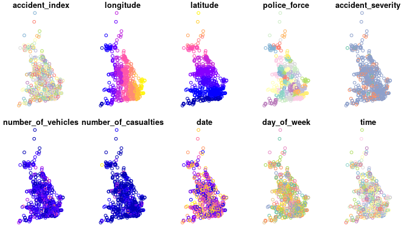

Reproducible road safety research: an exploration of the shifting spatial and temporal distribution of car-pedestrian crashes
================
Dr Robin Lovelace --- University of Leeds, Consumer Data Research Centre (CDRC) and Institute for Transport Studies (ITS) and Leeds Institute for Data Analytics (LIDA)
2019-01-31

Summary
=======

This paper demonstrates a reproducible analysis workflow for downloading, formatting and analysing road crash data. Building on the recently published **stats19** R package, the paper contains code that downloads 691,641 crash incidents, which are filtered-down to 78,448 car-pedestrian crashes. The dataset reveals variability in crash characteristics depending on the age of the person hurt, speed limits and location (urban-rural in the first instance). More importantly, the beginnings of evaluation metrics are shown using high-level geographic aggregation, raising many further questions and directions for future research using open road crash data.

<!-- Authors are requested to keep to the word limit of 1500 words. The word limit includes the main body of the abstract and everything within (including captions etc.,) and the references. Not included in the word count is the title, author list, date, summary, keywords and author biographies -->
**Keywords:** geographic analysis, road safety, reproducibility

Introduction
============

This paper is motivated by two high-level policy and academic objectives, which intersect. The policy objective is to engender decision making that is informed by high quality evidence and the 'best available data'. The academic objective is to ensure that research findings can be reproduced, to ensure scientific falsifiability and to encourage collaboration and cooperation between researchers, rather than competition. These two objectives intersect because without reproducible methods it is difficult to generate high quality evidence that can be externally verified. Conversely, an academic environment that is conducive to collaboration and not competition requires a government that supports open science, "the transparent and accessible knowledge \[and methods\] shared and developed through collaborative networks" \[@vicente-saez\_open\_2018\].

This context is relevant to many fields of research that have practical and policy implications. Road safety research is no exception, as its findings often have direct policy implications and can be highly emotive, raising questions about the divide between research and policy \[@elvik\_handbook\_2009\]:

> Can science and politics be kept apart in such a highly applied field of research? Where is the dividing line between science and politics in road safety?

More specifically, how can road safety research become more reproducible? This would clearly have advantages for many stakeholders: local and national governments would be better equipped to justify their road safety policies if the evidence on which they are based is the result of reproducible research conducive to 'citizen science' \[@bonney\_next\_2014\]; advocacy groups such as RoadPeace would be able to engage not only in lobbying, but also science, encouraging arguments from all sides to be based more on objective evidence, rather than emotive anecdote; and citizens themselves should benefit, from better road safety policies and the educational opportunities created by open science.

These considerations, and the more mundane observation that dozens of researchers were duplicating effort by cleaning STATS19 data --- the official source of road crash data in Great Britain \[@STATS19Data\] --- instead of pooling resources to allow the focus to shift onto the research, led to the development of software written in the statistical programming language R \[@rcore\]: **stats19**, an R package that was released on the Comprehensive R Archive Network (CRAN) in January 2019 \[@lovelace\_stats19\_2019\].

Much road safety research has been conducted using Geographic Information Systems (GIS) software \[e.g. @kim\_using\_1996; @peled\_pc-oriented\_1993; @steenberghen\_intra-urban\_2004;@razzak\_application\_2011\] and, with the growth of open source GIS products such as QGIS, this is a trend that can encourage open science, as defined above. A limitation of dedicated GIS software products from a reproducibility perspective, however, is that they tend to be based on a graphic user interface (GUI), rather than a command-line interface (CLI). This has led to many efforts to push geographic research in a more computational direction, under labels such as Geographic Information Science (GIScience), Geographic Data Science, and Geocomputation \[@lovelace\_geocomputation\_2019\].

On a practical level, the work detailed in this paper is indicative of reproducible worklflows because it uses code to define the geographic analysis steps undertaken and a stanardised API for accessing and processing data (**stats19** R package) \[@lovelace\_stats19\_2019\], allowing findings to be externally verified. By using RMarkdown to generate this paper, all main analysis steps are shown in code chunks which re-run each time the document is compiled \[@xie\_r\_2018\]. Beyond the high-level aims of evidence-based policy and reproducible research outlined above, this paper has a more specific purpose: to show that geographic road safety research *can* be reproducible, with an example that presents new findings on the shifting spatial distribution of car-pedestrian crashes at the national level over the last 5 years.

Set-up and data preparation
===========================

Full documentation of the `stats19` R package is published in @lovelace\_stats19\_2019. We include an example of how to access, process and briefly analyse data *within this paper*, to demonstrate the importance of such initiatives for enabling replication of methods, validation of findings and, subsequently, cumulative knowledge building.

The R packages used to access, process and analyse the STATS19 data can be installed and loaded as follows:

``` r
pkgs = c(
  "tidyverse",
  "sf",
  "stats19",
  "tmap"
)
```

``` r
install.packages(pkgs)
purrr::map_lgl(pkgs, require, character.only = TRUE)
```

    ## Warning: package 'tibble' was built under R version 3.5.2

    ## Warning: package 'stats19' was built under R version 3.5.2

    ## Warning: package 'tmap' was built under R version 3.5.2

    ## tidyverse        sf   stats19      tmap 
    ##      TRUE      TRUE      TRUE      TRUE

The following code downloads, formats and combines crash data over the past 5 years:

``` r
y = 2013:2017
a = map_dfr(y, get_stats19, type = "accidents")
```

The resulting dataset is large, consisting of more than half a million <!-- () --> (691,641) rows (crash points), with 31 columns \[see @lovelace\_stats19\_2019 for details on the data\]. This is easy to work with in-memory on modern computers, though consumes 1/3 GB of RAM. These can be converted into a spatial class, defined by the **sf** package \[@pebesma\_simple\_2018-1\]. A sample of 1000 records is taken and plotted, for demonstration purposes, as follows (see the resulting Figure 1):[1]

``` r
a_sf = format_sf(a)
a_sample = a_sf %>% sample_n(1000)
```

``` r
a_sample = readRDS("a_sample.Rds")
plot(a_sample)
```



Having gained a measure of the crash data, and some key descriptive statistics, we can proceed to join-on the associated casualty and vehicle tables. The following command uses the argument `type` to specify which table from the STATS19 schema is to be read-in:

``` r
c = map_dfr(y, get_stats19, type = "casualties")
v = map_dfr(y, get_stats19, type = "vehicle")
```

We are interested in accidents in which a pedestrian was injured and where the (only) vehicle involved was a car. This subset of the casualties dataset can be extracted as follows:

``` r
c_ped = c %>% filter(casualty_type == "Pedestrian")
v_car = v %>% filter(vehicle_type == "Car")
a_cp = a_sf %>%
  filter(number_of_vehicles == 1 & number_of_casualties == 1) %>% 
  filter(accident_index %in% c_ped$accident_index) %>% 
  filter(accident_index %in% v_car$accident_index)
```

Before proceeding, it is worth joining-on the vehicle and crash tables onto the crash data: <!-- , keeping only records in which casualty *and* vehicle data is present. -->

``` r
a_cpj = a_cp %>% 
  inner_join(v_car) %>% 
  inner_join(c_ped)
```

The resulting dataset, `a_cpj`, contains 78,454 rows: 11% of the crashes in the original dataset represent a car-pedestrian collision involving a single vehicle and a single casualty (the pedestrian). This dataset, which contains 68 columns, will be used for the remainder of this analysis. The final code chunk in this section generates plots that expose insight into the nature of car-pedestrian crashes. As illustrated in Figures 2 and 3, the results match prior expectations: elderly people (in the 66-75 and 75+ age bands) and fast roads (40 to 70 miles per hour) tend to result in more serious and fatal injuries.

``` r
g = ggplot(a_cpj)
```

``` r
p1 = g + geom_bar(aes(accident_severity, fill = urban_or_rural_area)) +
 facet_wrap(vars(speed_limit), scales = "free_y") +
  labs(fill = "Location")
p2 = g + geom_bar(aes(accident_severity, fill = impact)) +
  facet_wrap(vars(age_band_of_casualty), scales = "free_y") +
  theme(axis.text.x = element_text(angle = 45))
```


\newpage
Geographic analysis and results
===============================

The data is still in a spatial form, of class `sf`, enabling geographic analysis. Although the geographic resolution of the data is high, ~10 m, we will analyse it at the national level, to investigate the relative performance of different police forces over time. A geographic join will be used to assign a police force to each crash (although police force is already a variable in the dataset):

``` r
agg_slight = aggregate(a_cpj["accident_severity"], police_boundaries,
                      function(x) sum(grepl(pattern = "Slight", x)))
```


Repeating this process for each crash severity type results in the plot presented in Figure 3. Because a log scale is used between the different crash categories, the results shown in Figure 3 shows that, outside London, serious and fatal crashes are comparatively common in some areas. We can identify which police forces have the highest *ratios* of crashes that are reported as fatal. The top 5 and bottom 5 are shown in Table 1, which shows wide variability. As would be expected, large cities (where average speeds tend to be low) tend to have a relatively low percentage of car-pedestrian casualties that are fatal, whereas predominantly rural forces such as Wiltshire and Gloucestershire (where the roads tend to be faster, and there are fewer crashes overall) have a relatively high proportion that are fatal. Devon and Cornwall is an outlier: a relatively rural force with a low proportion of fatalities. Further research could seek to explore the reasons for this variability.

| name                |  slight|  serious|  fatal|  percent\_fatal|
|:--------------------|-------:|--------:|------:|---------------:|
| Wiltshire           |     428|      155|     15|             2.5|
| Gloucestershire     |     347|      137|     10|             2.0|
| West Mercia         |     772|      216|     20|             2.0|
| Northamptonshire    |     515|      187|     14|             2.0|
| Suffolk             |     546|      116|     13|             1.9|
| NA                  |      NA|       NA|     NA|              NA|
| Devon and Cornwall  |    1556|      384|     16|             0.8|
| Lancashire          |    1718|      626|     19|             0.8|
| Nottinghamshire     |    1102|      290|     10|             0.7|
| Metropolitan Police |   13552|     2303|    109|             0.7|
| City of London      |      69|       21|      0|             0.0|

\newpage
What about variability *over time*? The overall trend in the number of pestrians hit by cars can be seen in Figure 4, which shows the total number of people by month, broken-down by crash severity. This result shows that pedestrian casualty rates have essentially flat-lined over the past 5 years, after decades of improvement. What the data does not show, however, is the geographic breakdown of these trends.


A geographic join can assign each crash to a police authority as follows:

``` r
a_cps = st_join(a_cpj, police_boundaries)
```

The new object has the variable `pfa16nm`, the police force name, which can be subsequently aggregated and then joined back onto the geographic variable of `police_boundaries`. Before we plot the 'best' and 'worst' performers geographically, it is worth investigating the temporal trend of the top and bottom forces in terms of the percentage of casualties that were fatal (see Table 1). When disaggregated by force area (Figure 5), the incidence of fatalities is too low for reliable analysis over time. However, the results suggest that London (controlled by the Metropolitan Police) has seen an increase in serious, and to a lesser extent slight, pedestrian casualties since around the beginning of 2016. <!-- Lancaster has seen an increase in the number of fatalities per month, beginning around the same time. --> These raise the question: why? Rather than answer this question, the final analysis will explore the geographic distribution of improving/worsening performance by force area using geographically arranged small multiples \[@tufte\_visual\_1983\].


\newpage
We have identified some challenges associated with disaggregate analysis of casualty data: the substantial between-force differences in absolute casualty numbers and the problem of reliably identifying temporal patterns in low incidence events such as fatalities. One measure that might allow traction on the *relative severity* of accidents occuring in force areas is the killed and seriously-injured rate (KSI rate) -- the number of casualties that involved a fatality or serious injury as a proportion of all casualties. Analysing year-on-year change in KSI rates over the 5-year period, there appears to be a slight recent upward trend: from 0.22 in 2013-2015, to 0.23 in 2016 and 0.25 in 2017. A principled way of exploring the extent to which particular force areas are over- or under- represented in their KSI rates is by calculating risk ratios for each force (*R**R*<sub>*f*</sub>), expressing the KSI rate for the force (*k**s**i*<sub>*f*</sub>) as a ratio of the national KSI rate (*k**s**i*<sub>*n**a**t*</sub>): *R**R*<sub>*f*</sub> = *k**s**i*<sub>*f*</sub>/*k**s**i*<sub>*n**a**t*</sub>, where a value &gt;1.0 indicates a higher KSI rate than nationally and a value &lt;1.0 indicates a KSI rate lower than the national average rate. In order to analyse year-on-year change in these force-level risk ratios and the raw KSI rates, we generate sets of small multiple charts per force, arranged according to their approximate geographic position (e.g. Figure 6) using the layout algorithm published in @meulemans\_small\_2017. The first two maps in Figure 7 are choropleth maps displaying a single risk ratio statistic representing all 5 years of data; the final map supports year-on-year comparison by representing raw KSI rates as a line, with risk-ratios for each year as coloured bars.


<p class="caption">
An approximate geographical layout of England and Wales police force areas following the layout algorithm published in Muelmans et al. (2017).
</p>


<p class="caption">
Risk ratios of KSI rates by force area, from 2013 to 2017 (left and middle), with year-on-year trend in risk ratios and raw KSIs (right).
</p>

<!-- When the analysis presented in Figure 5 is conducted for *all* police jurisdictions, and an aggregate measure of 'direction of trend' is used (in this case, average increase/decrease in counts of crashes of different severity levels per year) is used, we can see the spatial distribution of improvement in casualty numbers across the country (see Figure 6). -->
<!-- It is clear that, assuming crash counts are a good metric of safety (which may not always hold, but is sufficient for the purposes of this paper), some areas perform much better than others. -->
<!-- In terms of fatal car-pedestrian crashes, it is clear that large regions including West Yorkshire, Greater Manchester and Northumbria are not performing well. -->
<!-- The trend for serious car-pedestrian crashes is even more mixed, with London and regions to the east (including Kent and Essex), seeing substantial upward trends in the number of pedestrians sersiously hurt in car crashes. -->
<!-- ```{r, echo=FALSE, fig.cap="Trend in car-pedestrian casualties by region, 2013 to 2017, in units of average number of additional casualties per year, by severity of injuries.", message=FALSE} -->
<!-- region = "Lancashire" -->
<!-- sev = "Fatal" -->
<!-- sel = a_cps$pfa16nm == region -->
<!-- a_cps_sub1 = a_cps[sel, ] -->
<!-- a_agg = a_cps %>%  -->
<!--   st_drop_geometry() %>%  -->
<!--   group_by(pfa16nm, year) %>%  -->
<!--   summarise( -->
<!--     Fatal = sum(casualty_severity == "Fatal"), -->
<!--     Serious = sum(casualty_severity == "Serious"), -->
<!--     Slight = sum(casualty_severity == "Slight") -->
<!--     ) -->
<!-- a_cor = a_agg %>%  -->
<!--   group_by(pfa16nm) %>%  -->
<!--   summarise( -->
<!--     Fatal = lm(Fatal ~ year)$coefficients[2], -->
<!--     Serious = lm(Serious ~ year)$coefficients[2], -->
<!--     Slight = lm(Slight ~ year)$coefficients[2] -->
<!--     ) -->
<!-- agg_cor = left_join(police_boundaries, a_cor) -->
<!-- a_highlight = filter(police_boundaries, pfa16nm %in% top_bottom$name[7:10]) -->
<!-- a_highlight$nm = stringr::str_sub(string = a_highlight$pfa16nm, start = 1, end = 3) -->
<!-- b = c(60, 5, 1, 0) -->
<!-- bb = c(-b, b[3:1]) -->
<!-- tm_shape(agg_cor) + -->
<!--   tm_fill(c("Fatal", "Serious", "Slight"), palette = "-Spectral", alpha = 0.8, breaks = bb) + -->
<!--   tm_borders() + -->
<!--   tm_shape(a_highlight) + -->
<!--   tm_borders(col = "blue", lwd = 2, alpha = 0.4) + -->
<!--   tm_text("nm")  -->
<!--   # tm_layout(legend.outside = T) -->
<!-- ``` -->
Discussion
==========

This paper has provided a taster of what is possible with open road crash data, automatically downloaded and formatted using the **stats19** package. It reveals interesting regional differences in the numbers, proportions and trends of one particular type of road crash: car-pedestrian collisions. Although roads are complex systems, and further research should seek to identify suitable denominators of risk (e.g. walking rates), we can draw some conclusions. The recent narional increase in serious and fatal casualties is concerning, especially given the government's commitment to contribute to the European Union's target of halving road traffic deaths by 2050.[2] The results reflect the overall findings that crash rates, and deaths in particular, have increased in recent years.[3] But beyond high-level aggregate analysis, the paper shows how road crash data can be disaggregated in many ways, including by casualty type (e.g. age, gender), time and location. Although many interesting results have been generated, the truth is that this paper only really scratches the surface of what is possible with the 68 columns and hundreds of thousands of roads of the joined STATS19 data.

This suggests many future areas of research. From a policy perspective, can automated summary graphics provide insight into performance and early warnings of increases in certain types of crashes? Can recent findings about the effectiveness of different interventions, particuarly around 20 mph zones and limits \[@grundy\_effect\_2009; @aldred\_cycling\_2018\] be replicated using open data and publicly available code?

From a GIS perspective, the data presented in this paper are undoubtedly of great interest in terms of their size (there are several million points in the open STATS19 data, going back to 1979), richness (with 50+ variables across 3 tables which can be judiciously joined) and spatial resolution (around 10m, although this has not been verified). This raises further questions about interactive data visualisation, for example using the `geoplumber` package, which builds on `plumber` \[@plumber\], and the possibility for web applications building on sites such as [www.crashmap.co.uk](https://www.crashmap.co.uk/). Although more theoretical directions are suggested by the complex processes that result in crashes (point patterns on a linear network), the recommendation from this paper is that future academic work is driven primarily by policy need.

Acknowldgements
===============

The work was funded by the Leeds Insititute for Transport Studies (ITS) Consumer Data Resarch Center (CDRC) at Leeds Institute for Data Analytics (LIDA). Thanks to open source software developers who made all this possbile, and to GitHub, where the source code behind this paper is hosted: <https://github.com/Robinlovelace/stats19-gisruk>

<!-- wordcountaddin::text_stats("stats19-gisruk/README.Rmd") -->
References
==========

[1] Note: to save re-running the previous code chunks, the sample dataset can be downloaded from <https://github.com/Robinlovelace/stats19-gisruk/releases>

[2] <https://fleetworld.co.uk/uk-falling-behind-on-road-safety-targets/>

[3] <http://www.brake.org.uk/facts-resources/1653-uk-road-casualties>
