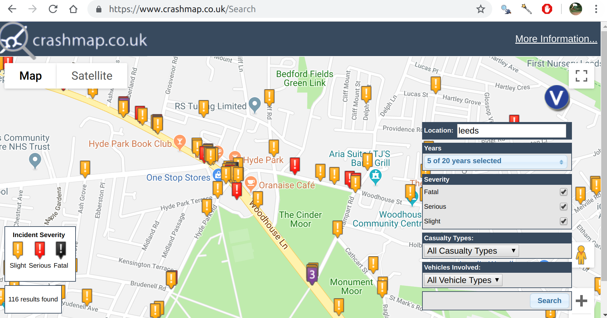

# Overview (to be commented out)

- Talk from ~10:30, 15 minutes and 5 minutes for questions
- History of crash research
- Geographic research
- Lack of reproducibility, time wasted cleaning data
- Data is inaccessible to public
- What stats19 can do for you (live demo?)
- Analyst use case
- Dashboard potential
- Interactive map interface (Layik)

---

# Introduction

- Roads kill more young, healthy people than any other cause of death

--

Source: [World Health Organization, 2018](https://www.who.int/news-room/fact-sheets/detail/the-top-10-causes-of-death)

???

Kills more people than war.

Inherently geographical.

Why isn't it a major branch of GIS research? Lack of data!

---

# History of crash research

---

# Geographic analyses of crashes

---

# (Lack of) reproducibility in road safety research

- Takes days to figure out STATS19 .csv files 
- Huge amount of time spent by researchers on data cleaning
- This is an error prone process

---

# (In)accessibility

---

- What stats19 can do for you (live demo?)
- Analyst use case
- Dashboard potential
- Interactive map interface (Layik)

